# MeshCore TEAM

Cross-platform MeshCore TEAM companion app for Android/iOS, built with Flutter.

This app talks to a **MeshCore companion radio** over **Bluetooth Low Energy (BLE)**, syncs contacts/channels/messages, and provides chat + map tooling (offline maps, waypoints, location sharing).

The app works with stock MeshCore firmware for basic messaging, contacts, channels, and maps. [Custom MeshCore firmware](https://github.com/tmacinc/MeshCore) is required for full functionality, including:

- **Smart forwarding** — app-managed multi-hop routing (forwarding policy engine)
- **Autonomous mode** — firmware-side GPS tracking without a phone connection
- **Full radio settings UI** — smart forwarding toggle, autonomous mode toggle

## Support

If you need help or have questions:

- 📧 Email: tmacinc090@gmail.com  
- 🐞 Report an issue: https://github.com/tmacinc/MeshCore-TEAM/issues  

Please include device type and app version when reporting issues.

## Screenshots

| Connection | Identity | Connection (sync) | Radio settings | Location tracking |
|---|---|---|---|---|
| 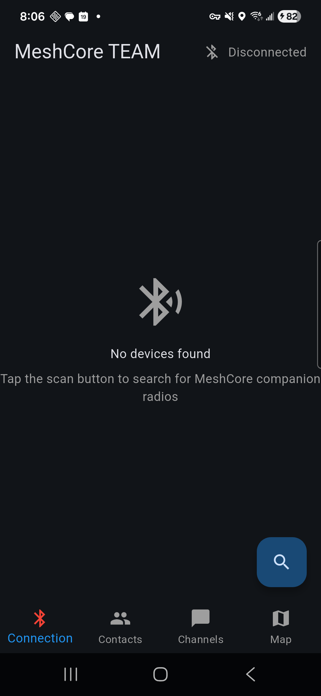 | 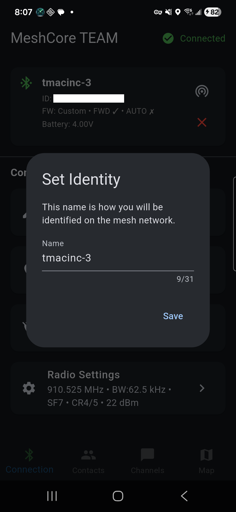 | 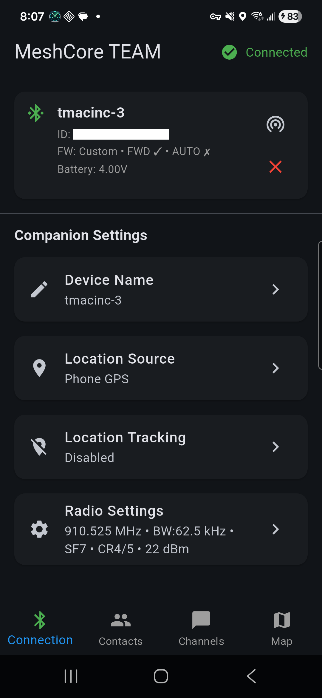 | 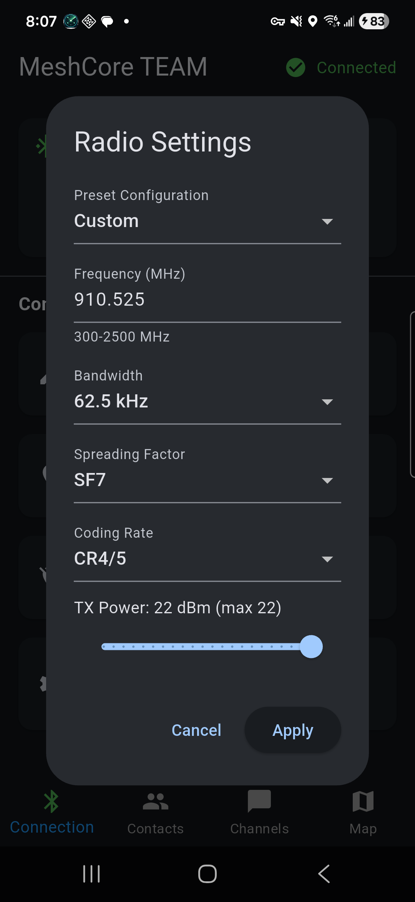 | 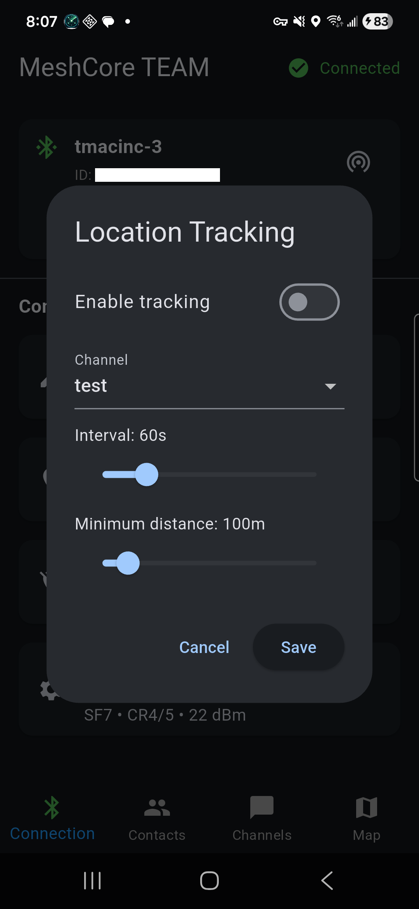 |

| Contacts | Direct message | Channels | Private channel | Share channel |
|---|---|---|---|---|
| 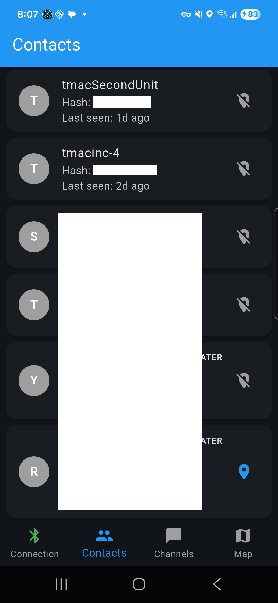 | 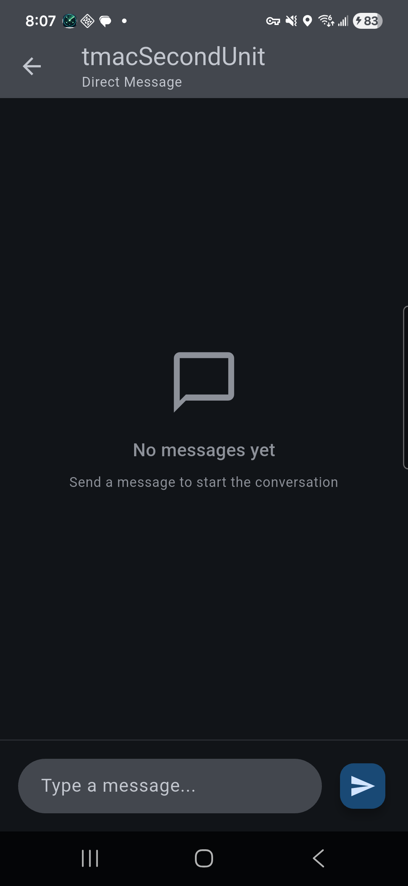 | 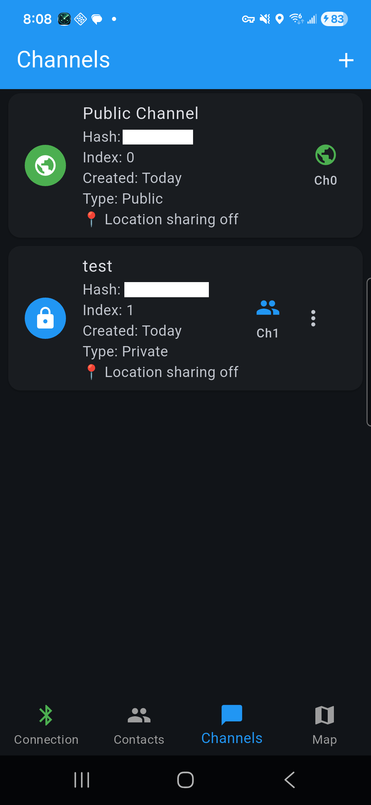 | 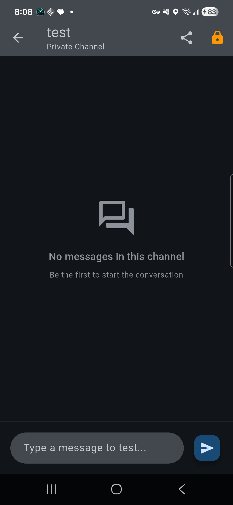 | 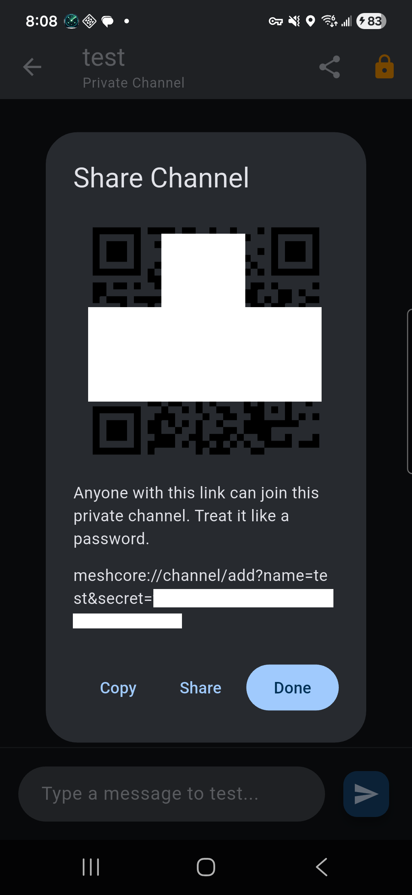 |

| Create/Add channel | Map |  |  |  |
|---|---|---|---|---|
| 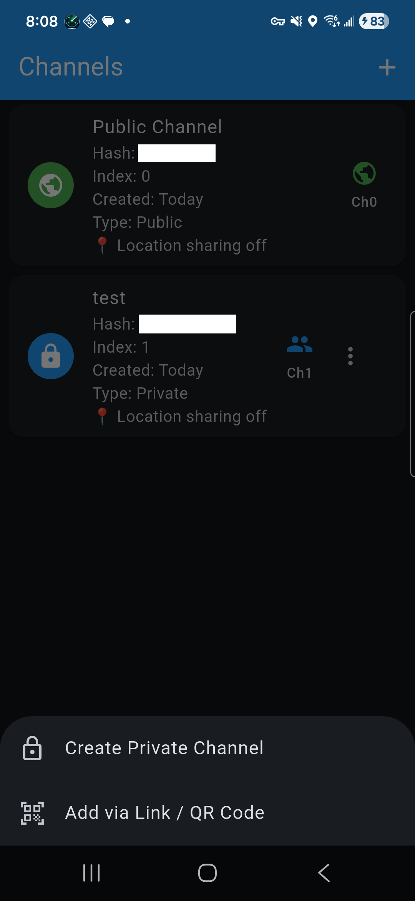 | 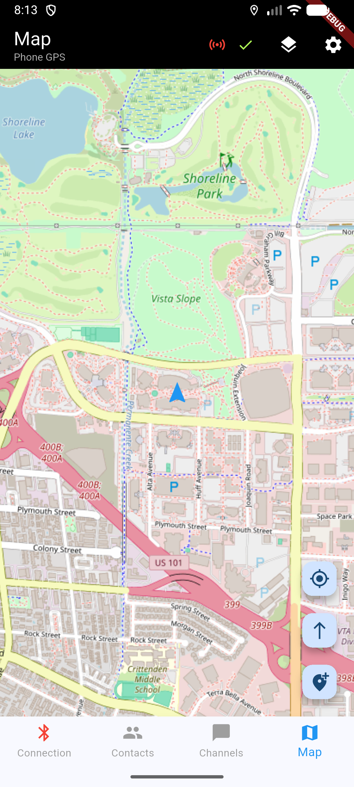 |  |  |  |

## What's in the app today

Core user-facing features that are already implemented:

- BLE scan/connect/disconnect with sync progress (contacts/channels/messages)
- Identity/name prompt (set how you appear on the mesh)
- Contacts list with unread badges + direct messages (repeaters are read-only)
- Channels list with unread badges
	- Create private channels
	- Import via link/QR
	- Share private channels via link/QR
- Map screen
	- Phone location + optional "track-up" mode
	- Contact markers (when location tracking is enabled)
	- Waypoints (create/edit/manage)
	- Routes (create multi-point paths, edit, color-code, share via mesh)
	- Offline map download + management
- Location settings
	- Location source: phone GPS vs companion radio GPS
	- Location tracking ("telemetry") to a selected private channel
- Companion radio settings (when supported by firmware)
	- Frequency/BW/SF/CR/TX power presets + custom values
	- Camp mode with dedicated camp presets and firmware repeat
- **Smart forwarding** (V1) — app-managed multi-hop routing via the forwarding policy engine
- **Autonomous mode** — firmware-side GPS tracking that operates without a phone connection
- Capability advertisement between peers (`#CAP:` on the telemetry channel)
- Team Config export/import
	- Export channels, waypoints, radio settings, and offline map tiles as a portable `.teamcfg.zip` file
	- Import config on a connected companion — channels are registered with the radio, radio settings applied, waypoints and map tiles merged
	- Named configs with per-item selection (choose which channels, waypoints, and map areas to include)
	- Offline sharing — serve configs over a local hotspot with QR code download (no internet required)
- Wipe Local Data — selectively clear channels (from firmware too), waypoints/routes, and offline maps with double confirmation
- Foreground service for background BLE stability (Android)
- iOS BLE lifecycle handling with deferred reconnect and stale connection cleanup

## Custom firmware

TEAM is designed to work with the [custom MeshCore firmware](https://github.com/tmacinc/MeshCore). While the app can connect to stock MeshCore radios for basic messaging, running custom firmware unlocks the full feature set:

| Feature | Stock firmware | Custom firmware |
|---|---|---|
| Smart forwarding (policy engine) | Not available | Full V1 engine with automatic `maxHops` management |
| Autonomous mode | Not available | Firmware-side GPS tracking without phone |
| Radio settings UI | Basic frequency/power | Smart Forwarding toggle, Autonomous Mode toggle |

The app detects custom firmware automatically via the `RESP_SELF_INFO` capability bitmask on connect. When stock firmware is detected, custom-only UI elements (forwarding toggles, autonomous mode) are hidden and the forwarding policy engine stays inactive. The connected device tile on the Connection screen shows the firmware type and supported capabilities (`FW: Custom • FWD ✓ • AUTO ✓`).

For flashing instructions, supported boards, and build guides, see the [MeshCore firmware repo](https://github.com/tmacinc/MeshCore).

## How forwarding works

Forwarding lets companion radios relay messages on behalf of nodes that can't reach each other directly. The app implements a **forwarding policy engine** that monitors the mesh in real time and automatically adjusts the companion radio's `maxHops` setting.

### Forwarding V1 (current)

The V1 strategy is driven by incoming telemetry (`#TEL`) events on the tracking channel:

1. **Activation** — forwarding activates for groups larger than 2 members, when any tracked peer either reports `needsForwarding=true` in its last telemetry, or hasn't been heard for longer than 5 minutes (stale).
2. **Hop calculation** — `maxHops` is set to `max(observed path length across triggering peers) + 1`, clamped to a ceiling of 4.
3. **Hold-down** — once every tracked peer is directly reachable again (observed path length = 0), a 5-minute hold-down starts. If no peer re-triggers during the hold, `maxHops` drops back to 0 (forwarding off).
4. **Peer signalling** — each node broadcasts its own `needsForwarding` and `maxPathObserved` values in outgoing telemetry so neighboring nodes can react cooperatively.

V1 does **not** use a forward list — the firmware handles routing internally based solely on `maxHops`.

### Enabling forwarding

Forwarding is available when the companion radio runs **custom firmware** that reports forwarding support. The engine activates automatically when:

- The radio is connected and reports `supportsForwarding`
- Location tracking (telemetry) is enabled
- In **non-camp mode**: the engine is always active
- In **camp mode**: enable the **Smart Forwarding** toggle in Radio Settings

A forwarding debug screen (accessible from the Connection tab) shows the current engine state, applied `maxHops`, strategy mode, and per-node details.

## How autonomous mode works

Autonomous mode offloads location tracking to the **companion radio's own GPS**, so the radio can continue broadcasting telemetry even when the phone is disconnected or out of range.

When enabled, the firmware independently:

- Acquires a GPS fix using the companion radio's GPS module
- Periodically transmits location updates on the configured tracking channel
- Respects the interval / minimum-distance thresholds configured in the app

### Enabling autonomous mode

1. Go to **Connection → Companion Settings → Location Tracking** and configure your tracking channel, interval, and minimum distance.
2. Open **Radio Settings** and toggle **Autonomous Mode** on.
3. The app writes your tracking parameters to the firmware. You'll see an orange "Autonomous mode active" indicator on the connected device tile.

Requirements:

- Custom firmware that reports `supportsAutonomous`
- A companion radio with a GPS module — the firmware will reject the enable command (ERR 6) if no GPS hardware is present
- A valid GPS fix before telemetry will begin transmitting

Autonomous mode and app-side location tracking are independent — you can run both, or use autonomous mode alone for "deploy and walk away" scenarios.

## Quickstart (dev)

### Prerequisites

- Flutter SDK with Dart `>= 3.6` (see `pubspec.yaml`)
- Android Studio (Android SDK + emulator) and/or Xcode (iOS, macOS only)
- A MeshCore companion radio running [custom firmware](https://github.com/tmacinc/MeshCore) (recommended for end-to-end testing)

### Run

```bash
flutter pub get
flutter run
```

On iOS (macOS), run CocoaPods once:

```bash
cd ios
pod install
cd ..
```

### Build

```bash
# Android
flutter build apk --release

# iOS (macOS)
flutter build ios --release
```

### Beta builds (with debug tooling)

A `BETA` compile-time flag enables the in-app debug log viewer and forwarding debug screen in release builds. This is useful for TestFlight / Play Store beta tracks where you want to collect logs from testers without shipping a debug build.

```bash
# iOS beta IPA (debug UI included, release performance)
flutter build ipa --release --dart-define=BETA=true

# Android beta APK
flutter build apk --release --dart-define=BETA=true

# Run on device to test locally
flutter run --release --dart-define=BETA=true
```

Regular release builds (without `--dart-define=BETA=true`) exclude all debug UI via compile-time tree-shaking.

## User guide

### 1) First launch: permissions

On first launch the app will show a permissions explainer screen. Tap the button to request permissions:

- **Bluetooth** (Scan + Connect on Android 12+): to discover and connect to the companion radio
- **Location**: required for BLE scanning on Android, and for the map / GPS features
- **Notifications**: message alerts when the app is in the background

On Android, you'll also be prompted about **battery optimization**. Disabling optimization for the app lets the foreground service keep the BLE connection alive when the screen is off.

### 2) Connect to a companion radio

1. Open the **Connection** tab (bottom nav, first icon).
2. Tap **Scan** — discovered MeshCore devices will appear in a list.
3. Tap a device to connect. The app will run an initial sync sequence:
   - **Device query** — reads firmware version and capability flags
   - **App start** — reads the radio's identity and radio parameters
   - **Contact sync** — pulls the contact list from the radio
   - **Channel sync** — pulls configured channels (up to 8 on custom firmware)
   - **Message sync** — pulls any queued messages
4. If this is a new companion (or the name has changed), you'll be prompted to confirm or set your **Identity** — the name others see on the mesh. Navigation is locked to the Connection tab until you confirm.

On subsequent connects to the same companion, the app runs an **incremental sync** (contacts + messages only, skipping channels) for a faster reconnect.

### 3) Contacts and direct messages

- Open **Contacts** (second tab) to see synced devices.
- Tap a contact to open a **Direct Message** conversation.
- If a contact is a **repeater**, direct messaging is disabled (you can still see it in the list).
- Unread badges show on the Contacts tab icon when new messages arrive.

### 4) Channels (group chat)

- Open **Channels** (third tab) to see all synced channels.
- Tap **+** to:
	- **Create Private Channel**
	- **Add via Link / QR Code**

Private channels can be shared from inside the channel chat via link or QR code.

Channel share links use this format:

`meshcore://channel/add?name=<name>&secret=<hex32>`

Treat the link like a password: anyone who has it can join the channel.

### 5) Map, offline maps, waypoints, and routes

- Open **Map** (fourth tab) to see your position.
- Use the map menus to:
	- change the map provider (layers icon)
	- download offline tiles (**Download Map Area**)
	- manage stored areas (**Manage Offline Maps**)
	- manage waypoints (**Manage Waypoints**)

Contact markers appear on the map when they have sent location telemetry on the tracking channel within the last 12 hours.

#### Waypoints

To create a waypoint, tap the **+** button on the map and choose **Create Waypoint**. Tap a location on the map, enter a name, select a type (Camp, Meetup, Hazard, Water, etc.), and save.

Waypoints can be edited or deleted from the map (tap the marker) or from the **Manage Waypoints** screen. Waypoints sync over the mesh — when another user receives a waypoint, it appears on their map automatically.

#### Routes

Routes let you draw multi-point paths on the map — useful for marking trails, patrol routes, or planned movement paths.

1. Tap the **+** button on the map and choose **Create Route**.
2. Tap points on the map to build the path. Points are connected in order as a polyline.
3. When finished, tap **Save** and enter a name, optional description, and choose a **route color** from the preset palette (purple, red, blue, green, orange, pink, teal, brown, grey, yellow).

To **edit an existing route**, tap the route on the map and choose edit. In edit mode you can:
- Drag existing points to adjust their position
- Add new points to extend the route
- Change the name, description, or color

Routes are stored as waypoints with type `ROUTE` — they share over the mesh like any waypoint. When received by another user, routes render as colored polylines on their map. Routes can also be included in **Team Config** exports and imported as part of a `.teamcfg.zip` file.

### 6) Radio settings

From the Connection tab, tap **Radio Settings** to configure:

- **Camp Mode** — locks the radio to camp-compatible presets and enables firmware repeat mode. When camp mode is on, manual frequency/BW/SF/CR controls are disabled.
- **Smart Forwarding** (camp mode + custom firmware) — enables the app-managed forwarding policy engine while camp mode is active.
- **Autonomous Mode** (custom firmware + GPS) — configures the firmware to track and broadcast location independently. See [How autonomous mode works](#how-autonomous-mode-works).
- **Preset / Custom** radio parameters — frequency, bandwidth, spreading factor, coding rate, TX power.

### 7) Team Config (export / import)

Team Config lets a group leader export channels, waypoints, radio settings, and offline map tiles as a single `.teamcfg.zip` file that other members can import to get set up quickly.

#### Exporting a config

1. Connect to your companion radio.
2. Tap the **⋮ menu** on the Connection screen and choose **Create Team Config**.
3. Enter a **config name** (e.g. "Alpha Team").
4. Select the **channels**, **waypoints**, and **offline map areas** to include. Toggle **Radio Settings** to include your frequency/bandwidth/SF/CR.
5. Tap **Export Config** and choose a save location.

The exported `.teamcfg.zip` contains a `config.json` (channels, waypoints, radio settings), tile area metadata, and cached map tiles. Share it with group members via email, USB, or any file transfer method — or use **Share Config Offline** (see below).

#### Importing a config

1. Connect to your companion radio (import requires an active connection).
2. Tap the **⋮ menu** on the Connection screen and choose **Import Team Config**.
3. Choose how to import:
   - **From File** — pick a `.teamcfg.zip` file from local storage.
   - **From QR Code** — scan a QR code served by another user's **Share Config Offline** session.
4. A preview dialog shows what's included. Tap **Import** to apply.
5. Channels are registered with the companion firmware, radio settings are applied, waypoints are merged (duplicates skipped), and map tiles are added to the local cache.

> **Note:** TX power is not included in the config — each radio keeps its own power setting. Channel indices are assigned automatically by the companion radio.

#### Sharing a config offline (no internet)

When your group has no internet access, you can share a config directly between phones using a Wi-Fi hotspot:

**On the sender's phone:**

1. Tap the **⋮ menu** on the Connection screen and choose **Share Config Offline**.
2. Follow the on-screen instructions to create a Wi-Fi hotspot on your device (steps vary by Android/iOS).
3. Tap **Continue**, then pick the `.teamcfg.zip` file to share.
4. Review the config details and tap **Confirm**.
5. The app starts a local web server and displays a **QR code**. A manual URL is also shown as a fallback.
6. When finished, tap **Finished** to stop the server.

**On each receiver's phone:**

1. Connect to the sender's Wi-Fi hotspot.
2. Open TEAM, connect to their companion radio, then tap **Import Team Config → From QR Code**.
3. Scan the QR code displayed on the sender's screen.
4. The config downloads automatically. Review the preview and tap **Import**.

### 8) Wipe Local Data

If you need to reset your device or clean up before redeploying, the **Wipe Local Data** option lets you selectively erase data:

1. Connect to your companion radio.
2. Tap the **⋮ menu** on the Connection screen and choose **Wipe Local Data**.
3. Select which categories to clear:
   - **Channels** — removes all private channels from the companion radio firmware and the local database. The public channel is never touched.
   - **Waypoints & Routes** — deletes all waypoints and routes from the local database.
   - **Offline Maps** — removes all downloaded tiles and area metadata.
4. Tap **Wipe Selected**, then confirm a second time. This action is permanent.

### 9) Location tracking and group setup

Location tracking sends periodic location updates to the mesh via a **private channel**. All group members share telemetry packets on that channel.

#### Setting up tracking for a group

1. **Create a private channel** — go to the Channels tab and create a new private channel for your group.
2. **Share the channel** — share the channel link or QR code with all group members so they can join.
3. **Configure tracking** — each member goes to **Connection → Companion Settings → Location Tracking**, enables tracking, and selects the shared private channel.
4. **Set preferences** — choose interval, minimum-distance thresholds, and the location source (**phone GPS** or **companion radio GPS**).
5. **Verify** — once all members are configured, the map should begin to populate with user locations as telemetry packets are received.

When tracking is enabled, the app broadcasts your position on the selected channel. Other TEAM users on the same channel will see your marker on their map. When tracking is disabled, contact markers are hidden from the map.

#### Requirements

- All group members must be **contacts** in the companion radio.
- Each member must have tracking **enabled** and set to the **same private channel**.

#### Automatic contact discovery

When a telemetry packet arrives on the private channel from an unknown user, the app forces an advert request to discover and add the new contact. This works network-wide — new members should be validated and appear on the map after a couple of telemetry intervals.

## iOS support

TEAM is built with Flutter and fully supports both Android and iOS.

### What works

All core features run on iOS — connection, contacts, channels, map, messaging, radio settings, and the full BLE sync flow. BLE scan/connect works on real iOS devices (BLE is not available in the iOS simulator).

### BLE lifecycle

iOS-specific BLE lifecycle handling has been implemented:

- **Deferred reconnect** — when the app returns to the foreground, it automatically reconnects to the last connected companion radio.
- **Stale connection cleanup** — on disconnect, lingering CoreBluetooth connections are force-cleaned to prevent ghost connections.
- **Adapter readiness** — scanning waits for the Bluetooth adapter to report ready (CoreBluetooth can briefly report "unknown" on first launch).
- **Reconnection manager** — exponential backoff (2 s → 30 s max) handles transient disconnects.

### Permissions

Permissions are requested sequentially to avoid stacking iOS system dialogs:

1. Location (When In Use)
2. Notifications
3. Bluetooth (requested last to avoid the local-network prompt appearing before the user has context)

### Background operation

The app declares `bluetooth-central`, `location`, and `processing` background modes. However, iOS does not allow true foreground services like Android. The BLE connection may be suspended when the app is backgrounded for extended periods. Reconnection on resume is handled automatically, but brief gaps are expected compared to Android's always-on foreground service.

### Known limitations

- **Background BLE persistence** — iOS may suspend the BLE connection after several minutes in the background. The app reconnects on resume, but real-time message delivery while backgrounded is not guaranteed.
- **Always-location upgrade** — the current permission flow requests When In Use location. Upgrading to Always (for background location tracking) is planned.

See [ios/TODO.md](ios/TODO.md) for the detailed iOS parity checklist.

## Roadmap

Planned features and improvements (see also the [issues tracker](../../issues)):

- **Forwarding V2** — topology-aware routing using the mesh graph model (`#T:` topology events). V2 will build a real-time network graph and use it to compute targeted forward lists (`SET_FORWARD_LIST`) instead of relying solely on `maxHops`. The topology strategy skeleton is in place and currently falls back to V1; the graph model and prefix-based routing logic are next.
- **iOS background reliability** — improve BLE connection persistence using Core Bluetooth state restoration; implement the Always-location upgrade flow for background tracking.
- 1.0.3 Added - **Group member location history** — track and display historical location trails for group members on the map.
- 1.0.3-beta2 Added - **Team Config export/import** — export/import channels, waypoints, radio settings, and offline map tiles as a portable `.teamcfg.zip` file for easy group onboarding. Includes offline sharing via local hotspot + QR code.
- Topology map visualization — display the mesh network graph on the map screen
- Multi-companion device switching

### Possible future features

- **User alias** — allow members to use an alias on the mesh, maintaining privacy outside of their private group.
- **Multiple group handling with tagging** — manage membership in multiple groups with tagging/filtering to keep conversations organized.

## Troubleshooting

- **No BLE devices found**: ensure Bluetooth + Location permissions are granted; on Android 12+ also ensure Bluetooth Scan/Connect permissions are allowed.
- **Disconnects when screen turns off (Android)**: accept the battery optimization exemption prompt; keep the app allowed to run in the background.
- **Map shows no contacts**: enable Location Tracking (telemetry) on the Connection screen. Contacts must have sent telemetry within the last 12 hours to appear.
- **Can't DM a device**: repeaters are intentionally blocked from direct messages.
- **Autonomous mode won't enable**: the companion radio must have a GPS module. If the firmware returns ERR 6, the hardware doesn't support GPS.
- **Forwarding not activating**: ensure you're on custom firmware, telemetry is enabled, and (if in camp mode) Smart Forwarding is toggled on.

## License

### Non-Commercial Use Only

This project is licensed under the Creative Commons Attribution-NonCommercial-ShareAlike 4.0 International License.

- See `LICENSE` for full terms.
- Third-party attributions: `NOTICES.md`.

### Commercial licensing

For commercial use, contact: tmacinc090@gmail.com

## Disclaimer

This is a hobby/research project provided "as is", without warranty. Use at your own risk.
