# MeshCore TEAM User Guide

MeshCore TEAM is an Android and iOS app for keeping a group together when there's no cell signal. Your phone connects over Bluetooth to a MeshCore **companion radio**, and the radios carry your team's positions, messages, waypoints and routes over a LoRa mesh. No accounts, no servers and no internet are needed.

This guide covers setting the app up, getting a team tracking each other on the map, and every screen after that. It describes version 1.2.

* Table of contents
{:toc}

---

## What you need

- **A phone** running Android or iOS, with the MeshCore TEAM app installed.
- **A MeshCore companion radio** for each person. It's a small LoRa radio running MeshCore *companion* firmware that pairs with your phone over Bluetooth.
- **Everyone on the same radio settings** (frequency, bandwidth, spreading factor, coding rate). Radios on different settings can't hear each other. A [Team Config](#10-team-config-set-everyone-up-at-once) is the easiest way to get everyone matched.

### Stock or custom firmware

TEAM works with stock MeshCore companion firmware. [Custom TEAM firmware](https://github.com/tmacinc/MeshCore) adds a few extras:

| Feature | Stock firmware | Custom firmware |
|---|---|---|
| Messaging, contacts, channels, map, tracking, Team Config | ✓ | ✓ |
| **Smart forwarding** (radios relay team traffic automatically when someone is out of direct range) | – | ✓ |
| **Autonomous mode** (the radio keeps sending your position using its own GPS, even with the phone off or out of range) | – | ✓ |

The app detects your firmware when you connect. Settings that need custom firmware are hidden when you're on stock firmware.

---

## 1. First launch

The first time you open the app, it takes you through three steps.

1. **Choose your language.** Pick English, Deutsch, Español, Français, Italiano, Nederlands or Português, or **Use device language**. You can change it later in [App settings](#12-app-settings).
2. **Permissions.** The app explains what it needs and why, including how your location is used, before any system prompt appears:
   - **Bluetooth** to connect to your mesh radio.
   - **Location** to show you on the map and share your position with your team.
   - **Notifications** to alert you when messages arrive.
   - **Background** to keep the radio connection and tracking running when the app isn't on screen.

   Your location goes over your radio to your team only. It is never uploaded to a server.
3. **Set your name.** This is the name your team sees. See [Your two names](#3-your-two-names) before you answer. You can skip it and set it later.

**On Android** you'll also be asked to turn off **battery optimization** for the app. Tap **Allow**. Otherwise Android may cut the Bluetooth link when the screen turns off, and tracking stops.

**On iOS** you'll see the blue location indicator while tracking runs in the background. That's expected.

---

## 2. Connect to your radio

  <figure><figcaption>Not connected</figcaption></figure>
  <figure><figcaption>Scanning</figcaption></figure>
  <figure>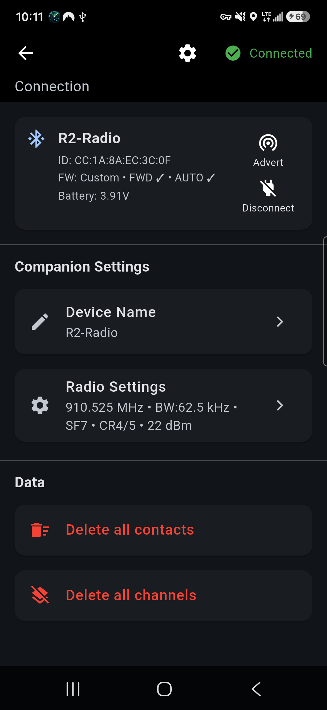<figcaption>Connected</figcaption></figure>

1. Open the **Connection** screen. Tap the Bluetooth icon in the top bar, or open the **☰ menu** and choose **Connection**.
2. Tap the **search** button. Nearby MeshCore radios appear in a list.
3. Tap your radio. The app connects and syncs contacts, channels and waiting messages from it (*Syncing Contacts… Syncing Channels… Syncing Messages…*).
4. The first time you connect a radio, you're asked to **Set Identity**, which is the radio name. See the next section.

Once connected, the card at the top shows the radio's name, ID, battery voltage and firmware. `FW: Custom • FWD ✓ • AUTO ✓` means custom firmware with forwarding and autonomous mode available. The card also has two buttons:

- **Advert** announces your radio to the mesh so others can add you.
- **Disconnect** ends the Bluetooth connection.

Below the card:

- **Companion Settings** holds the radio's **Device Name** and [Radio Settings](#11-radio-settings).
- **Data** has **Delete all contacts** and **Delete all channels**. They clear the phone and the radio. Favorite contacts and the public channel are kept.

The app reconnects to the same radio automatically if the link drops. To stop it trying, tap the Bluetooth icon and choose **Stop reconnecting**.

---

## 3. Your two names

  <figure><figcaption>Setting the radio name</figcaption></figure>
  <figure>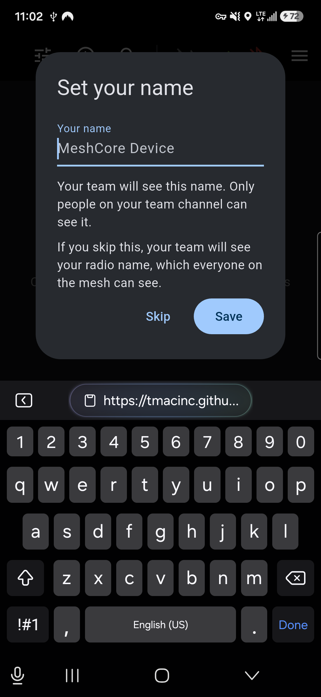<figcaption>Setting your name</figcaption></figure>

You have two names, and they're seen by different people.

| | **Radio name** | **Your name** |
|---|---|---|
| Who sees it | **Everyone on the mesh**, including people outside your team | **Only your team** (people on your tracking channel) |
| Where to set it | Asked the first time you connect a radio. Change it under **Connection → Companion Settings → Device Name** | Asked on first launch. Change it under **App Settings → General** |
| Tip | Consider something anonymous | Use the name your team knows you by |

Your team sees *your name* on the map, in contacts, in chat and in notifications, with your radio name underneath. Everyone else sees only the radio name. Replies and @mentions always use radio names, so your name is never sent into a public channel.

If you leave your name blank, your team sees your radio name instead.

---

## 4. Getting around

The app has three tabs along the bottom: **Contacts**, **Channels** and **Map**.

The top bar on every screen shows:

- **Location sharing**. Tap it to turn tracking on or off, or to open App Settings. The icon is crossed out when you aren't sharing.
- **Forwarding status**. A check mark means default routing. A hop count means forwarding is active.
- **Bluetooth**. Tap it to open Connection, disconnect, or stop reconnecting.
- **☰ menu**: **Connection**, **App Settings** and **About**.

---

## 5. Set up your team (quick start)

This is the most important part. It gets everyone on your team showing on each other's maps.

Tracking works over a **private channel**. Everyone on the team joins the same private channel and sends their position on it. Only people with that channel's key can read those positions. Public and hashtag channels can't be used for tracking, because anyone can work out their key.

1. **One person creates the channel.** Go to **Channels**, tap **+** and choose **Create Private Channel**. Give it a name, for example `Alpha Team`.
2. **Share it with the team.** Open the channel, tap its share button, and show the **QR code** or send the **link**. Everyone else goes to **Channels → + → Add via Link / QR Code** and scans or pastes it.
3. **Everyone turns on tracking.** Tap the location-sharing icon in the top bar, or go to **App Settings → Location → Location Tracking**, and switch it on. If you have only one private channel it's picked automatically. Otherwise you're asked which channel to share your location on.
4. **Check the map.** Within a couple of update intervals, teammates appear on the **Map** tab. The app adds team members as contacts for you. You don't need to swap keys by hand.

> **Faster option:** the team leader can put the channel, radio settings, waypoints and offline maps into a single [Team Config](#10-team-config-set-everyone-up-at-once) file that everyone imports in one step.

> **Treat channel links and QR codes like passwords.** Anyone who has one can join the channel and see your team's positions and messages.

---

## 6. Location tracking

  <figure>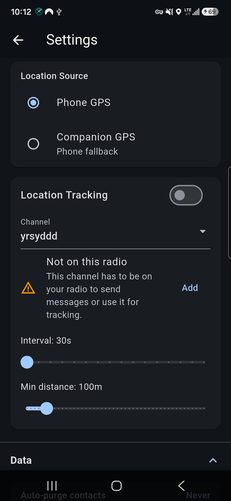<figcaption>App Settings → Location</figcaption></figure>

Tracking settings are in **App Settings → Location**.

- **Location Source**:
  - **Phone GPS** uses your phone's location.
  - **Companion GPS** uses the radio's own GPS module if it has one, and falls back to the phone if the radio has no fix.
- **Location Tracking** switches sharing on and off.
- **Channel** is the private channel your position is sent on. If the channel isn't on the connected radio, you'll see **Not on this radio**. Tap **Add** to put it back.
- **Interval** and **Min distance**: your position is sent when the interval has passed *or* you've moved more than the minimum distance. Shorter intervals give fresher positions but put more traffic on the mesh and use more battery.
- **Always On Location** (iOS) lets location updates continue in the background.

The channel you're sharing on is marked **Location sharing on** in the Channels list.

When tracking is off, your position isn't sent and teammates are hidden from your map.

---

## 7. Contacts and direct messages

- The **Contacts** tab lists everyone your radio knows. Team members are shown by the name they chose, with their radio name underneath and a small group icon.
- Tap a contact to open a **direct message**. Repeaters are listed but can't be messaged.
- Tap the **star** on a contact to make it a favorite.
- **Search** by name or hash. Use the top-bar menus to **filter** (End Nodes, Repeaters, Has location, No location, Favorites) and **sort** (last seen, name, favorites first).
- **Long-press** a contact to **copy contact info** (name, hash, location, battery, type) or **delete** it.

### Heard nearby

Your radio no longer stores every device it hears. Devices it hears but doesn't add appear under **Heard nearby** at the top of Contacts, with **Add** and **Dismiss** buttons. Team members sharing location on your tracking channel are always added for you. Entries you ignore disappear after 7 days.

Repeaters, room servers and sensors are still added to the radio as normal.

> **Note:** this setting stays on the radio. If you stop using TEAM, turn contact auto-add back on from any MeshCore app.

---

## 8. Channels and messaging

Tap **+** on the **Channels** tab to:

- **Create Private Channel**. The app generates a new secret key.
- **Join Hashtag Channel**. Its key comes from its `#name`, so anyone who types the same name joins the same channel, and no QR code is needed. Hashtag channels aren't private.
- **Add via Link / QR Code**. Scan a QR code, paste a `meshcore://` link, or enter a name and secret by hand.

Other channel features:

- **Share a private channel** from its chat screen as a QR code or link.
- **Star** a channel to make it a favorite. Sort the list by message count, name, channel number or favorites.
- **Long-press a channel** to set its **notifications**:
  - **Normal** gives all notifications.
  - **Silent** gives no alerts, but the unread badge still shows.
  - **Muted** gives no alerts and no badge.

  The same menu has the **Team channel** switch, **Add to radio** and **Delete Channel**.

### Messages

- Type `@` to mention someone. A list of names from the channel appears.
- A `#hashtag` in a message is a link. Tap it to join that hashtag channel.
- **Long-press a message** to copy it or reply. A reply adds an @mention so the other person sees who you're answering.
- New messages don't pull you to the bottom of the chat. An **Unread Messages** marker shows where they start.

### Team channels

A **team channel** is a private channel that belongs to your phone rather than to one radio. Your tracking channel becomes a team channel automatically, and you can make any private channel one with the **Team channel** switch in its long-press menu.

- It **survives switching radios**, along with its chat history.
- If the connected radio doesn't have it, it's shown greyed out as **Not on this radio**. You can read its history, but you can't send or receive on it until you add it back. The app offers to add it when you tap the message box or pick it for tracking. If the radio's channel slots are full, delete a channel from the radio first.
- Team channel messages are kept for **30 days**.

### Switching to a different radio

Your team is remembered by the app, not the radio. When you pair a new radio, the app copies your team contacts onto it and sends an advert so the team learns the new radio. Team channels, chat history and last known positions stay on the phone. Your teammates keep seeing you as the same person, even if you swap radios with one of them.

---

## 9. The map

  <figure><figcaption>Map</figcaption></figure>
  <figure>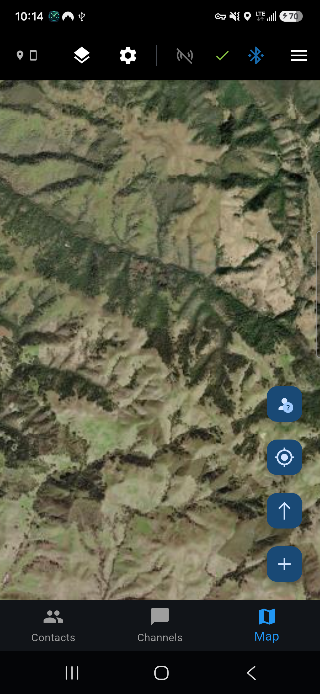<figcaption>Satellite view</figcaption></figure>
  <figure>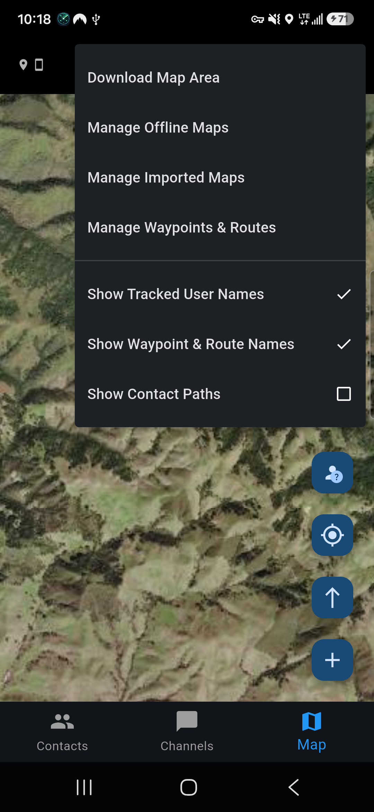<figcaption>Map settings menu</figcaption></figure>

The map shows you, your teammates, waypoints and routes.

**Top bar**

- **GPS source** (top left) shows whether your position comes from the phone or the radio, and whether the phone has a fix.
- **Layers** (map type) chooses the base map: OpenStreetMap, OpenTopoMap, USGS Topographic, USGS Satellite, ESRI Satellite, Humanitarian, Carto Voyager, or **No Map (markers only)**. It also turns imported maps on or off.
- **Gear** (map settings):
  - **Download Map Area** saves map tiles for offline use.
  - **Manage Offline Maps** shows and deletes saved areas.
  - **Manage Imported Maps** holds your KMZ and MBTiles maps.
  - **Manage Waypoints & Routes**.
  - **Show Tracked User Names** and **Show Waypoint & Route Names** turn map labels on or off to reduce clutter.
  - **Show Contact Paths** draws a dotted trail of each teammate's recent positions.

**Buttons on the right**

- **Group status** (person with a ?) lists your team, most recent first, with how they're connected (direct or number of hops) and when each person was last heard.
- **My location** centers the map on you and follows you.
- **Orientation** switches between north-up and track-up (the map turns with your direction of travel).
- **+** creates a waypoint or route.

### Teammates on the map

Teammates appear when they've sent a position in the last 12 hours. Each marker's color shows how recently and how directly they were heard:

| Color | Meaning |
|---|---|
| 🟢 Green | Heard directly in the last 5 minutes |
| 🟡 Yellow | Heard through 1–3 relays in the last 5 minutes |
| 🟠 Orange | Heard through more than 3 relays in the last 5 minutes |
| 🔴 Red | Not heard for 5–10 minutes |
| ⚪ Grey | Not heard for over 10 minutes |

**Tap a marker** to see the person's hop count, last heard time, coordinates and battery (radio and phone). From there you can **Show/Hide Path**, **Navigate** to them, **Direct message** them, or **Remove from group** to hide them from your map. **Double-tap** a marker for a quick summary.

### Offline maps

Download map areas **before you lose signal**.

1. Pan and zoom the map so the area you want fills the screen.
2. Choose **Gear → Download Map Area**.
3. Give it a name, set the **zoom range** (higher zoom means more detail and a bigger download) and tap **Download**.

Tiles are saved from the base map you have selected. Saved areas work with no connection at all. You can manage or delete them, and see how much storage they use, from **Manage Offline Maps**. They can also go into a [Team Config](#10-team-config-set-everyone-up-at-once).

### Imported maps (KMZ and MBTiles)

**Manage Imported Maps → Import Map** accepts:

- **Garmin KMZ** custom maps, such as scanned paper maps or hunting unit maps.
- **MBTiles** offline tile sets made with QGIS, GDAL or Mobile Atlas Creator.

They're drawn on top of the base map in the right place. Show or hide each one from the **Layers** menu or the Imported Maps screen.

### Waypoints

  <figure>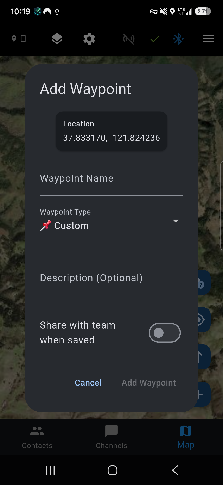<figcaption>Add waypoint</figcaption></figure>

1. Tap **+** and choose **Create Waypoint**.
2. Move the map so the **+** crosshair in the middle sits on the spot, then tap **✓**.
3. Enter a **name**, pick a **type** (Camp, Meetup, Danger, Game Area, Deer Stand, Water, Vehicle or Custom), and add an optional description.
4. Turn on **Share with team when saved** to send it to your team. It appears on their maps automatically.

**Tap a waypoint** on the map to **Navigate** to it, **Share via Mesh**, edit it or delete it.

**Manage Waypoints & Routes** lists everything, split into local (yours) and received (from teammates). From there you can:

- **Select Multiple** to share, export or delete several at once.
- **Import from GPX** and **Export to GPX** to exchange waypoints with other mapping apps and GPS units.
- **Delete All Local** or **Delete All Received**.

### Routes

  <figure>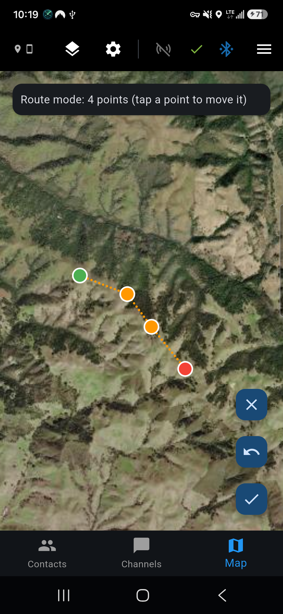<figcaption>Drawing a route</figcaption></figure>

Routes are multi-point paths, useful for trails, patrol routes or a planned line of travel.

1. Tap **+** and choose **Create Route**.
2. Tap the map to add points in order. The start is green and the end is red. To move a point, tap it and then tap its new position. **Undo** removes the last point.
3. Tap **✓**, then give the route a name, an optional description and a **Route Color**. Turn on **Share with team when saved** to send it to your team.

A route needs at least two points. To change the points later, tap the route on the map and choose **Edit Route Points**. To change its name, description or color, use **Edit Route Info** in **Manage Waypoints & Routes**. You can only edit waypoints and routes you created, not ones received from teammates.

---

## 10. Team Config: set everyone up at once

  <figure>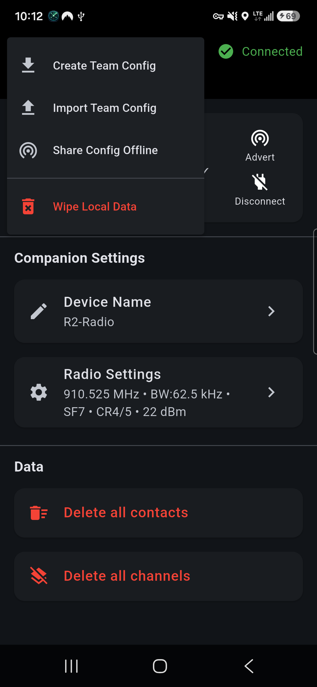<figcaption>Connection ⋮ menu</figcaption></figure>
  <figure>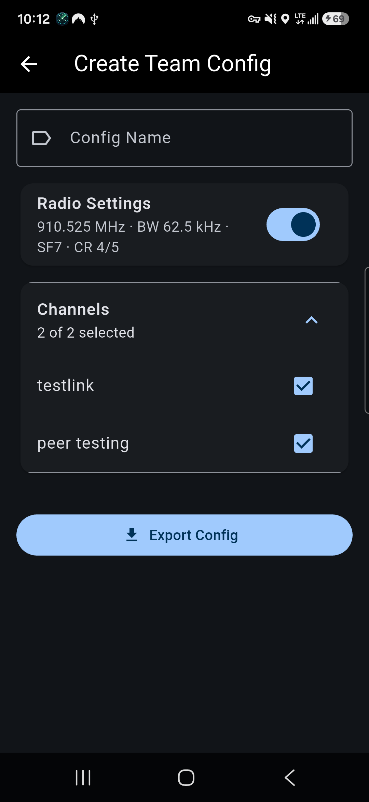<figcaption>Create Team Config</figcaption></figure>

A **Team Config** is a single `.teamcfg.zip` file containing channels, radio settings, waypoints, routes, offline map areas and overlay maps. The team leader makes one, and everyone else imports it to be set up in one step.

### Create a config

1. Connect to your radio and open the **⋮ menu** on the Connection screen.
2. Choose **Create Team Config**.
3. Enter a **Config Name** (for example `Team Alpha`), then choose what to include: **Radio Settings**, **Channels**, **Waypoints & Routes**, **Offline Map Areas** and **Overlay Maps**. Each section has **Select All**.
4. Tap **Export Config** and save or share the file (messaging app, email, USB and so on).

### Import a config

1. Connect to your radio. Importing needs a connection because channels have to be written to the radio.
2. Open the **⋮ menu** and choose **Import Team Config**.
3. Pick **From File**, or **From QR Code** if someone is sharing offline (below).
4. Check the preview and tap **Import**. The channels go onto your radio, the radio settings are applied, and waypoints and maps are added. Duplicates are skipped.

> **Note:** transmit power isn't included. Each radio keeps its own power setting.

### Share a config with no internet

**Share Config Offline** sends a config directly from phone to phone over a Wi-Fi hotspot.

**Sender**

1. **⋮ menu → Share Config Offline**.
2. Follow the on-screen steps (iPhone or Android) to turn on your phone's hotspot, then tap **Continue**.
3. **Choose File** to pick the `.teamcfg.zip`, check the details and tap **Confirm**. A **QR code** appears, with a manual download address underneath.
4. Tap **Finished** when everyone has it. This stops sharing.

**Each receiver**

1. Join the sender's Wi-Fi hotspot.
2. Connect to your own radio, then go to **⋮ menu → Import Team Config → From QR Code**.
3. Scan the sender's QR code, check the preview and tap **Import**.

---

## 11. Radio settings

  <figure>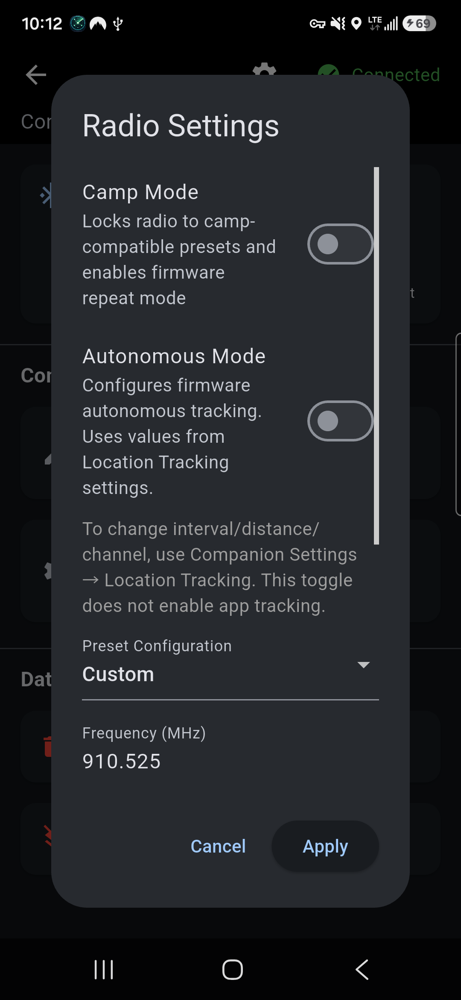<figcaption>Radio Settings</figcaption></figure>

Open **Connection → Companion Settings → Radio Settings**.

- **Preset Configuration** lets you pick a preset, or **Custom** to set **Frequency**, **Bandwidth**, **Spreading Factor** and **Coding Rate** yourself. **Everyone on the team must match.**
- **TX Power** sets transmit power, up to your radio's maximum. It doesn't need to match.
- **Camp Mode** limits the radio to camp presets and turns on firmware repeating, so your radio relays traffic for others. Manual radio values are locked while it's on.
- **Smart Forwarding** (custom firmware, camp mode) lets the app turn relaying on when a teammate is out of direct range, and off again when everyone is back in range. Outside camp mode it runs automatically whenever tracking is on. The top bar shows when forwarding is active and how many hops it's using.
- **Autonomous Mode** (custom firmware and a radio with GPS) makes the radio send your position by itself. It uses the channel, interval and distance from your [Location Tracking](#6-location-tracking) settings, and keeps working when your phone is off, out of range or disconnected. That's handy for a radio left in a vehicle or at camp. It doesn't send until the radio has a GPS fix. It's separate from phone tracking, so you can run either or both, and teammates see an autonomous radio's phone battery as *Autonomous (no phone)*.

Tap **Apply** to send the changes to the radio.

---

## 12. App settings

  <figure>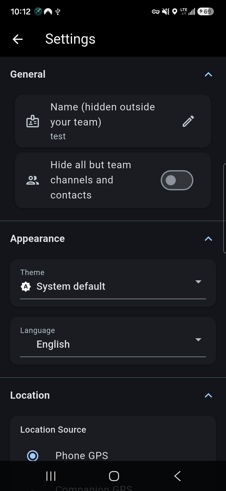<figcaption>General &amp; appearance</figcaption></figure>
  <figure>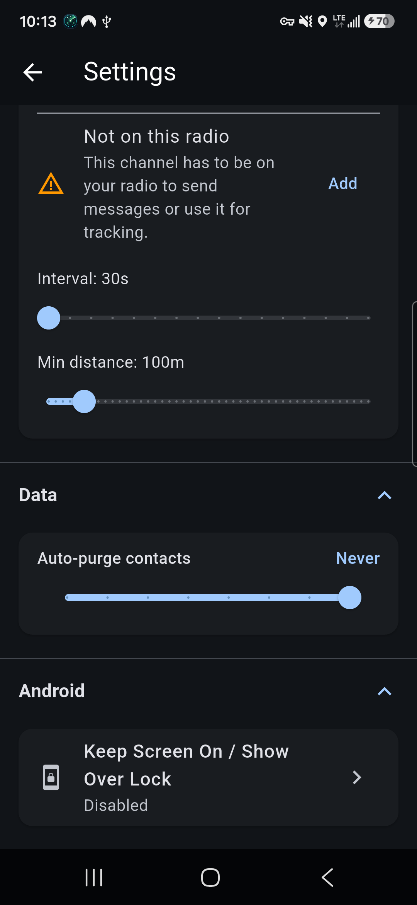<figcaption>Data &amp; Android</figcaption></figure>
  <figure>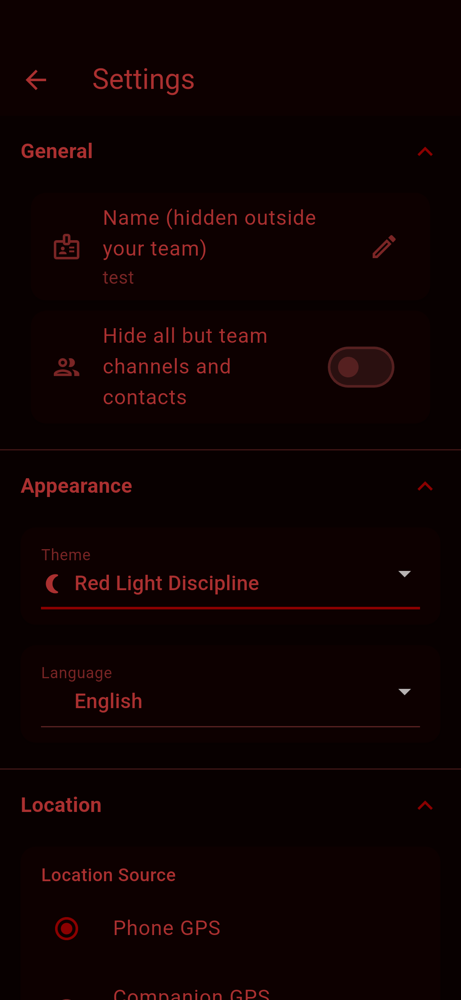<figcaption>Red Light Discipline</figcaption></figure>

Open **☰ menu → App Settings**.

**General**

- **Name (hidden outside your team)** is your name. See [Your two names](#3-your-two-names).
- **Hide all but team channels and contacts** shows only your team in the Channels and Contacts tabs.

**Appearance**

- **Theme**: System default, Light, Dark or **Red Light Discipline**. Red Light Discipline turns the whole app dim red, red-filters the map, hides the system bars and adds a clock. It lets you read the screen at night without ruining your night vision or lighting yourself up.
- **Language**: Use device language, English, Deutsch, Español, Français, Italiano, Nederlands or Português.

**Location**

- Location source, Location Tracking and (iOS) Always On Location. See [Location tracking](#6-location-tracking).

**Data**

- **Auto-purge contacts** removes contacts you haven't heard from in a chosen number of days. It's set to **Never** by default.

**Android**

- **Keep Screen On / Show Over Lock** keeps the screen awake and shows the app over the lock screen, so you can glance at the map or chat without unlocking.

---

## 13. Wiping data

Open the **⋮ menu** on the Connection screen and choose **Wipe Local Data**. Tick any of:

- **Channels**: private channels are cleared from the phone and the radio. The public channel is never touched.
- **Waypoints & Routes**.
- **Offline Maps**: downloaded tiles and their details.

Tap **Wipe Selected** and confirm. It can't be undone.

---

## Troubleshooting

| Problem | What to try |
|---|---|
| **No radios found when scanning** | Check that Bluetooth and Location permissions are allowed. On Android 12 and later, also allow *Nearby devices*. Make sure Bluetooth is on, the radio is on, and it isn't connected to another phone. |
| **Connection drops when the screen is off (Android)** | Allow the battery optimization exemption, and let the app run in the background in your phone's battery settings. |
| **Tracking turns itself off with "Create a private channel first"** | You have no private channel to share on. Create or join one, then turn tracking on again. |
| **Teammates don't show on the map** | Check that tracking is **on** for everyone, everyone picked the **same channel**, and all radios use the **same radio settings**. People only appear after they've sent a position in the last 12 hours. |
| **"Not on this radio" on a channel** | The connected radio doesn't have that channel. Tap **Add**. If the radio is full, delete an unused channel first. |
| **Can't message a contact** | It's a repeater. Repeaters can't receive direct messages. |
| **Autonomous mode won't turn on** | It needs custom firmware and a radio with a GPS module. Error `ERR 6` means the radio has no GPS. |
| **Forwarding never activates** | It needs custom firmware and tracking turned on. In camp mode, also turn on **Smart Forwarding**. |
| **Someone is out of range** | Use camp mode or smart forwarding so radios in between relay traffic, or add a MeshCore repeater. |

---

## Help and privacy

- **Report a problem:** [GitHub issues](https://github.com/tmacinc/MeshCore-TEAM/issues). Please include your phone model and app version (**☰ menu → About**).
- **Email:** [tmacinc090@gmail.com](mailto:tmacinc090@gmail.com)
- **Privacy:** TEAM has no accounts, analytics or servers. Your data stays on your phone and the mesh. Read the full [Privacy Policy](privacy/).
- **Firmware:** [custom MeshCore firmware](https://github.com/tmacinc/MeshCore) for flashing instructions and supported boards.
